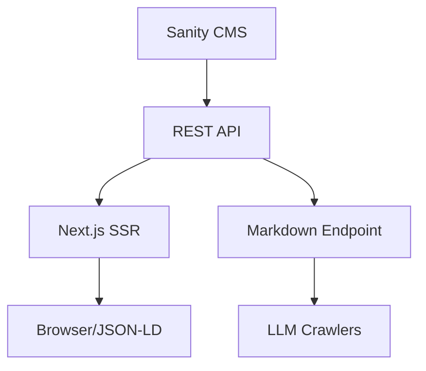

# 📋 Vunachain Project Audit

**Date:** February 8, 2026  
**Status:** ✅ Production Ready

---

## Executive Summary

Vunachain is an **EUDR compliance and supply chain traceability platform** for agricultural cooperatives. The platform enables blockchain-based harvest traceability with gasless transactions for farmers and integrates M-Pesa for mobile money payouts.

| Metric | Value |
|--------|-------|
| **Backend Apps** | 3 Django apps |
| **Smart Contracts** | 2 (V1 + V2) |
| **Frontend Components** | 14 React components |
| **Test Coverage** | 309 lines (lead_capture) |
| **Deployment** | Vercel (frontend) + Railway (backend) |

---

## Technology Stack

### Backend
| Technology | Version | Purpose |
|------------|---------|---------|
| Django | 5.0 | Web framework |
| Django REST Framework | - | API layer |
| GeoDjango | - | Geospatial support |
| PostgreSQL + PostGIS | - | Production database |
| Jazzmin | - | Admin UI |

### Frontend
| Technology | Purpose |
|------------|---------|
| React 18 | UI framework |
| Vite | Build tool |
| TailwindCSS | Styling |
| Framer Motion | Animations |

### Blockchain
| Technology | Purpose |
|------------|---------|
| Solidity 0.8.20 | Smart contracts |
| Hardhat | Development/testing |
| Celo Network | L1 blockchain |
| Web3.py | Python integration |

### Infrastructure
| Service | Purpose |
|---------|---------|
| Vercel | Frontend hosting |
| Railway | Backend hosting |
| Sanity.io | Headless CMS |

---

---

## AI-Native Architecture

Vunachain's architecture is designed for **LLM readability and reasoning**. It consists of three semantic layers:

1.  **Semantic HTML5**: Skeleton structured with `<header>`, `<main>`, `<article>`, and `<section>` for effortless parsing.
2.  **JSON-LD Schema.org**: The "AI-Brain" layer providing structured metadata for search engines and knowledge graphs.
3.  **LLM Markdown Endpoint**: A native `/api/content/[slug].md` endpoint that returns raw Markdown, optimizing parsing speed for AI agents.

### Data Flow


---

## Sanity.io CMS Setup

The project uses Sanity.io as a headless CMS, optimized for the "Content Lake" model.

- **Project ID**: `7iqshxb6`
- **Primary Studio**: `apps/cms`
- **Core Schemas**:
    - `Post`: 14 LLM-optimized fields including SEO settings and auto-generated Markdown.
    - `Author`: Profile info with bio and social links.
    - `PortableText`: Rich text editor with support for code blocks and semantic headers.

---

## Detailed API Reference

**Base URL (Prod):** `https://vunachainbackend-production.up.railway.app/api`

### 1. Lead Capture & Analytics
| Method | Endpoint | Purpose | Request Body |
|--------|----------|---------|--------------|
| POST | `/leads/demo-request/` | Submit demo request | `{name, email, company, interest}` |
| POST | `/leads/subscribe/` | Email subscription | `{email, source}` |
| POST | `/analytics/roi-interaction/` | Log ROI interaction | `{input_volume, calculated_loss, crop_type}` |

### 2. Blockchain & Compliance
| Method | Endpoint | Purpose | Notes |
|--------|----------|---------|-------|
| POST | `/harvests/` | Submit harvest | Requires JWT (`Authorization: Bearer`) |
| GET | `/plots/` | Retrieve plot data | Public |
| GET | `/compliance/summary/` | Compliance stats | Public |

### 3. Authentication
- **POST** `/api/token/`: Obtain JWT `access` and `refresh` tokens using `username` and `password`.

---

## ROI Calculation Methodology

The Vunachain ROI Estimator uses verified industry data to calculate the "Cost of Inaction" versus "Recoverable Profit."

### Formula Logic
- **Inaction Loss** = `(Procurement Volume * 1,000 + Input Credit * 200) * CropRiskFactor`
    - **Side-Selling Impact (1,000 KES/MT)**: Based on reports from the Kenyan Tea Development Agency (KTDA) and avocado export unions, unverified diversion to brokers costs cooperatives ~8-12% of potential revenue via volume leakage and quality dilution.
    - **Credit Default Risk (200 KES/Farmer)**: Represents the high risk premium of manual input financing. Automating recovery via smart contracts eliminates this "hidden tax."
- **Recoverable Profit** = `70% of Inaction Loss`
    - Industry benchmarks (e.g., IDH Farmfit) suggest that digitizing supply chains recovers 65-80% of value lost to middle-man leakage and operational friction.

### Crop Risk Factors
| Crop | Factor | Rationale |
|------|--------|-----------|
| **Avocado** | 2.5x | Extreme price volatility and strict EUDR export standards. |
| **Tea** | 1.8x | High volume processing requirements and Kenyan Tea Act 2020 compliance. |
| **Dairy** | 1.4x | High frequency of small transactions; primarily perishability-driven risk. |

---

---

## Security

### Implemented ✅
- HTTPS enforced in production
- CORS restricted to specific origins
- CSRF protection enabled
- XSS protection headers
- `X-Frame-Options: DENY`
- API rate limiting (100/day, 10/minute for anonymous)
- Work email validation for demo requests

### Environment Variables
| Variable | Required | Purpose |
|----------|----------|---------|
| `SECRET_KEY` | Yes (prod) | Django secret |
| `DATABASE_URL` | Yes (prod) | PostgreSQL connection |
| `CELO_PRIVATE_KEY` | Yes | Relayer wallet key |
| `ALLOWED_HOSTS` | Yes (prod) | Allowed domains |

---

## Test Coverage

### `lead_capture` App (309 lines)
| Test Class | Tests | Coverage |
|------------|-------|----------|
| `DemoRequestAPITests` | 7 | All validation paths |
| `EmailSubscriptionAPITests` | 7 | All subscription flows |
| `ROICalculationAPITests` | 7 | All calculator inputs |
| `HealthCheckAPITests` | 1 | Health endpoint |
| `ModelTests` | 5 | Model __str__ and meta |

**Run tests:**
```bash
cd apps/backend
python manage.py test lead_capture -v2
```

### Missing Coverage
- `blockchain_sync` app (0 tests)
- `blockchain` utilities (0 tests)
- Smart contract tests (Hardhat)

---

## Deployment

### Production URLs
| Service | URL |
|---------|-----|
| Frontend | https://vunachain.com |
| Backend | https://vunachainbackend-production.up.railway.app |
| Admin | https://vunachain.com/admin |

### Local Development
```bash
# Backend
cd apps/backend
python -m venv venv && source venv/bin/activate
pip install -r requirements.txt
python manage.py migrate
python manage.py runserver  # http://localhost:8000

# Frontend
cd apps/landing
npm install
npm run dev  # http://localhost:3000
```

---

## Recommendations

### High Priority
1. **[CRITICAL] Secure `blockchain_sync` API** - `FarmerViewSet` and `HarvestViewSet` are currently public (`AllowAny`). Limit to authenticated users or specific roles.
2. **[CRITICAL] Enable Strict Mode (Frontend)** - `tsconfig.json` is missing `"strict": true`, leading to potential type safety issues.
3. **Add blockchain tests** - `blockchain_sync` and `blockchain` modules lack tests.
4. **Document env vars** - Create `.env.example` with all required variables.

### Medium Priority
5. **API versioning** - Consider `/api/v1/` prefix for future changes.
6. **Smart contract deployment docs** - Add Hardhat deployment instructions.
7. **M-Pesa integration testing** - Document Daraja API sandbox setup.
8. **Railway Config Cleanup** - `railway.toml` has redundant healthcheck definitions.

### Completed ✅
9. **Update documentation** - Reflected Tea Act 2020 and Dashboard hiding logic (Feb 8, 2026).
10. **SEO Optimization** - Implemented OG tags, Twitter cards, robots.txt, and sitemap.

---

**Last Verified Trace:** Full Project Audit (Security, Architecture, Infra) completed.

**Generated:** February 8, 2026  
**Next Review:** Recommended quarterly

---

## Appendix: Implementation & Setup Guide

### Phase 1: Local Development Setup
1. **CMS (Sanity)**:
   - `cd apps/cms`
   - `npm install`
   - `npm run dev` (Opens at http://localhost:3333)
2. **Frontend (Next.js)**:
   - `cd apps/landing`
   - `npm install`
   - `npm run dev` (Opens at http://localhost:3000)
3. **Backend (Django)**:
   - `cd apps/backend`
   - `python -m venv venv && source venv/bin/activate`
   - `pip install -r requirements.txt`
   - `python manage.py runserver` (Opens at http://localhost:8000)

### Phase 2: Content Creation
1. Go to Sanity Studio (localhost:3333).
2. Create an **Author**.
3. Create a **Post** (optimized for AI parsing).
4. Click **Publish**.

### Phase 3: Validation
- **Semantic HTML**: `curl http://localhost:3000/blog/[slug] | grep "<article>"`
- **JSON-LD**: Check page source for `ld+json` block.
- **Markdown Endpoint**: `curl http://localhost:3000/api/content/[slug].md`
